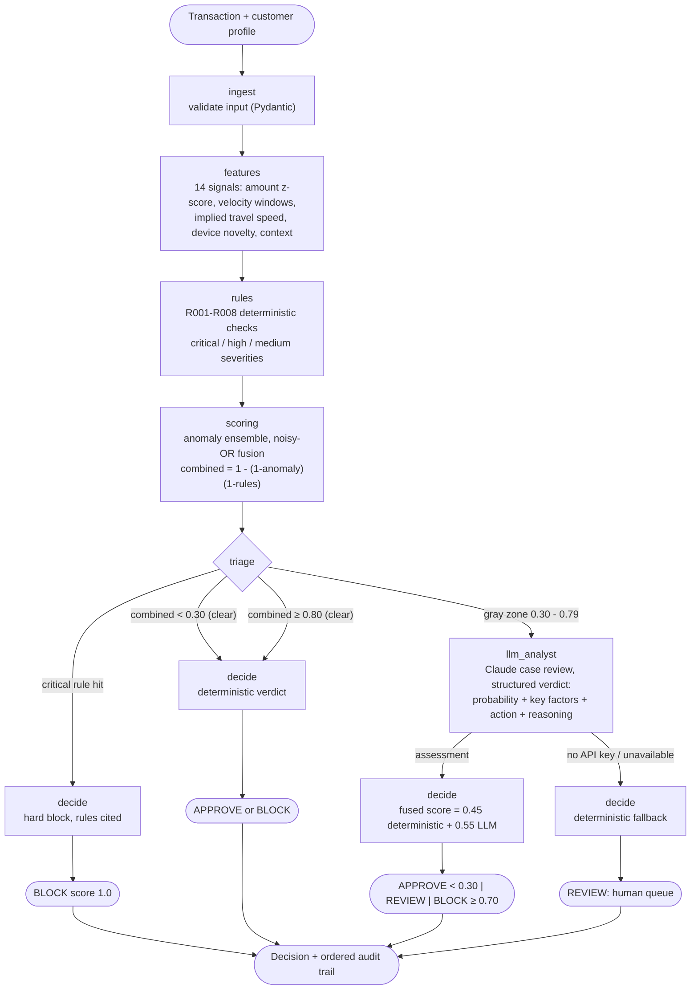

# LangGraph Fraud Detection Agent

A production-style transaction fraud detection agent built on [LangGraph](https://github.com/langchain-ai/langgraph). It combines a deterministic rule engine, statistical anomaly scoring, and a Claude-powered analyst into a single tiered pipeline that is fast for clear cases, smart for ambiguous ones, and auditable end to end.

[](https://github.com/MONISMALIK1/langgraph-fraud-detection/actions/workflows/tests.yml)

## Why this architecture

Most transactions are clearly legitimate or clearly fraudulent. Sending every one to an LLM would be slow, expensive, and impossible to audit. Production fraud systems therefore run in tiers, and this project mirrors that:

1. **Rule engine first.** Known fraud patterns (card testing, impossible travel, blocklists) are deterministic checks with rule IDs. When a dispute or regulator asks "why was this blocked", the answer is a rule ID and a plain-English detail, not a probability.
2. **Statistical anomaly scoring second.** A weighted ensemble over engineered features (amount z-score, velocity, implied travel speed, device novelty, context) catches subtle deviations rules cannot enumerate. It is pure Python, deterministic, and costs microseconds.
3. **LLM analyst only for the gray zone.** Transactions that are neither clearly safe nor clearly fraudulent are routed to Claude, which receives the full case file and must answer with a structured verdict (fraud probability, key factors, recommended action, reasoning) -- never free text. The LLM adds contextual judgment exactly where it earns its cost.
4. **Human review as the final safety valve.** Mid-band decisions become REVIEW cases with a complete audit trail, matching how real fraud operations keep humans in the loop.

Two invariants are enforced by the graph itself:

- A critical rule hit (hard block) never consults the LLM. The block is instant and fully explainable.
- The LLM can escalate a decision but can never single-handedly override deterministic evidence into an approval.

## Architecture



State flows through typed nodes (`FraudState`, a `TypedDict`); the `audit_trail` field uses an additive reducer so every node appends its own line and the final state carries an ordered account of how the decision was reached.

### Decision policy

| Combined risk | Route | Outcome |
|---|---|---|
| Critical rule hit | Straight to decision | BLOCK, score 1.0 |
| < 0.30 | Straight to decision | APPROVE |
| 0.30 - 0.79 | LLM analyst | Score fused (45% deterministic, 55% LLM); APPROVE / REVIEW / BLOCK by threshold |
| >= 0.80 | Straight to decision | BLOCK |

Rule score and anomaly score are fused with a noisy-OR (`1 - (1-a)(1-r)`), the standard way to combine independent evidence: either signal alone can raise the total, and together they compound.

### Graceful degradation

If `ANTHROPIC_API_KEY` is not set (or the analyst fails), gray-zone transactions fall back to deterministic scores and land in the human-review queue. LLM availability can never take the payment pipeline down.

## Quickstart

```bash
git clone https://github.com/MONISMALIK1/langgraph-fraud-detection.git
cd langgraph-fraud-detection
python3 -m venv .venv && source .venv/bin/activate
pip install -r requirements.txt

# Optional: enables the Claude analyst for gray-zone cases
export ANTHROPIC_API_KEY=sk-ant-...

python demo.py
```

The demo runs three scenarios: a routine coffee purchase (APPROVE), a card-testing burst with impossible travel (BLOCK), and a large purchase from an unrecognised device (gray zone -- Claude assesses it, or it goes to human review without a key).

### Using it as a library

```python
from fraud_agent import build_graph

graph = build_graph()
result = graph.invoke({
    "transaction": {
        "transaction_id": "txn_1",
        "customer_id": "cust_1",
        "amount": 850.0,
        "merchant": "TechDeals Online",
        "merchant_category": "electronics",
        "country": "US",
        "timestamp": "2026-07-16T15:30:00",
        "channel": "online",
        "device_id": "dev_new",
    },
    "customer_profile": {
        "customer_id": "cust_1",
        "avg_transaction_amount": 120.0,
        "std_transaction_amount": 60.0,
        "known_devices": ["dev_usual"],
    },
})
print(result["decision"])   # action, final_score, reasons, audit-ready explanation
print(result["audit_trail"])
```

`build_graph(analyst=...)` accepts any callable that takes the graph state and returns an assessment dict (or `None`), so the LLM backend is swappable and fully mockable in tests.

## Tests

The suite covers feature engineering, every rule, score fusion, and the full compiled graph with injected fake analysts -- no API key or network needed.

```bash
pip install -r requirements-dev.txt
pytest -v
```

## Project structure

```
fraud_agent/
    models.py        Pydantic input models (Transaction, CustomerProfile)
    features.py      Deterministic feature engineering (velocity, geo, amount, device)
    rules.py         Rule engine with severities and hard blocks (R001-R008)
    scoring.py       Anomaly ensemble, noisy-OR fusion, risk bands
    llm_analyst.py   Claude analyst with structured output and key-less fallback
    graph.py         LangGraph assembly: nodes, triage routing, decision policy
demo.py              Three end-to-end scenarios
tests/               Unit + end-to-end tests (offline)
docs/architecture.md Deeper design notes and extension points
```

## Extending

- **Checkpointing / memory:** `build_graph(checkpointer=...)` accepts any LangGraph checkpointer for resumable, per-thread state.
- **Human-in-the-loop:** the REVIEW band is the natural place for LangGraph `interrupt()` to pause for an analyst verdict.
- **Feature store:** `CustomerProfile` currently travels with the request; swap it for a lookup node against a real feature store.
- **Model choice:** set `FRAUD_AGENT_MODEL` (defaults to `claude-sonnet-5`).

See [docs/architecture.md](docs/architecture.md) for node-by-node detail, the threat model, and known limitations.

## License

MIT
